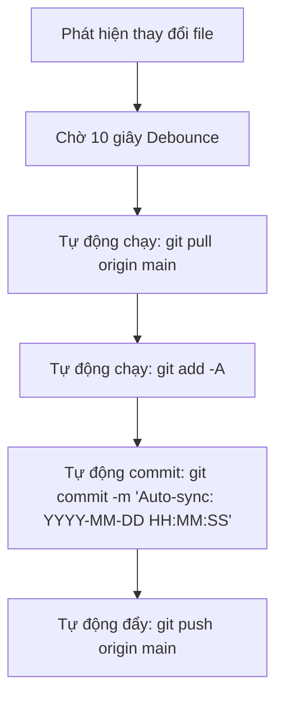

# Dịch Vụ Tự Động Đồng Bộ Hóa Git (Windows Git Auto-Sync Service)

Dịch vụ chạy ngầm tự động đồng bộ hóa (Autopilot 100%) dành cho tất cả các kho lưu trữ Git nằm ở thư mục gốc ổ đĩa `E:\` và các thư mục con cấp 1 của nó trên hệ điều hành Windows.

---

## 🚀 Tính Năng Nổi Bật

* **Quản lý trực quan (Web Dashboard Manager)**: Giao diện web tuyệt đẹp chạy tại cổng 3000 (`http://localhost:3000`) giúp xem danh sách dự án đang theo dõi, trạng thái, lịch sử logs dạng terminal thời gian thực và các nút điều khiển tắt/đồng bộ nhanh.
* **Phát hiện động (Dynamic Scanning)**: Tự động quét và phát hiện các kho lưu trữ Git (các thư mục có chứa `.git`) tại ổ `E:\` và các thư mục con cấp 1 sau mỗi 30 giây.
* **Đồng bộ thông minh (Debounce Mechanism)**: Cơ chế trì hoãn (mặc định 10 giây) giúp gom nhiều thay đổi liên tiếp (trong quá trình viết code) vào một lần đồng bộ duy nhất, tối ưu băng thông và giảm số lượng commit rác.
* **Chạy ngầm không cửa sổ (Windowless Daemon)**: Khởi chạy hoàn toàn ẩn danh thông qua tiến trình VBScript, không gây phiền toái hoặc hiện các cửa sổ Command Prompt đen trên màn hình.
* **Tự khởi động cùng Windows**: Tự động đăng ký vào khóa Registry Run để khởi động cùng hệ thống mỗi khi máy tính bật lên.
* **Bảo mật và tự động hóa thông tin đăng nhập**: Tích hợp chặt chẽ với **Git Credential Manager (GCM)**, tự động ghi nhớ tài khoản sau lần xác thực đầu tiên và đồng bộ hoàn hảo không cần tương tác.
* **Chống xung đột (Sequential Execution Queue)**: Đồng bộ hóa tuần tự theo hàng đợi trên từng kho lưu trữ để ngăn ngừa lỗi tranh chấp khóa index (`index.lock`).

---

## 🛠️ Hướng Dẫn Cài Đặt (Autopilot Setup)

Chúng tôi đã thiết lập sẵn trình cài đặt tự động một chạm [setup.bat](file:///E:/git_auto_sync_service/setup.bat). Bạn chỉ cần:

1. Mở thư mục `E:\git_auto_sync_service` trong File Explorer.
2. Nhấp đúp chuột vào tệp [setup.bat](file:///E:/git_auto_sync_service/setup.bat).
3. Chọn **Yes** khi được yêu cầu cấp quyền Administrator.

> [!NOTE]
> Trình cài đặt sẽ tự động kiểm tra sự tồn tại của Node.js, Git, cấu hình thông tin định danh toàn cục (`pkhoa@gmail.com`), cấu hình trình nhớ mật khẩu, đăng ký tự khởi động và kích hoạt dịch vụ chạy ngầm ngay lập tức.

---

## 📊 Kiểm Tra Trạng Thái & Nhật Ký

Bạn có thể theo dõi và kiểm tra tình trạng dịch vụ bất kỳ lúc nào:

* **Giao diện Web Dashboard**: Truy cập địa chỉ [http://localhost:3000](http://localhost:3000) trên trình duyệt để quản lý trực quan danh sách dự án, kích hoạt đồng bộ hoặc theo dõi logs thời gian thực.
* **Tập lệnh kiểm tra nhanh**: Nhấp chuột phải vào [verify_sync.ps1](file:///E:/git_auto_sync_service/verify_sync.ps1) và chọn *Run with PowerShell* để xem dịch vụ có đang chạy hay không và mã số tiến trình (PID) của nó.
* **Nhật ký hoạt động (Logs)**: Mở tệp nhật ký [sync.log](file:///E:/git_auto_sync_service/sync.log) để xem chi tiết các hoạt động phát hiện tệp thay đổi, commit thành công hoặc đẩy mã nguồn lên Git.
* **Tệp khóa trạng thái**: Khi dịch vụ chạy, tệp tạm thời `E:\.sync.lock` sẽ xuất hiện để lưu trữ PID hoạt động. Dịch vụ sẽ tự động dọn dẹp tệp này khi tắt.

---

## 📂 Cơ Chế Hoạt Động Chi Tiết

Khi phát hiện có sự thay đổi tệp tin trong các kho lưu trữ được giám sát, chu kỳ đồng bộ sẽ diễn ra tự động như sau:

Nếu kho lưu trữ chưa cấu hình liên kết từ xa (`remote origin`), dịch vụ sẽ chỉ thực hiện commit cục bộ và bỏ qua bước đẩy để đảm bảo không gây gián đoạn hoặc lỗi hệ thống.

# Triggering a change for testing notifications
